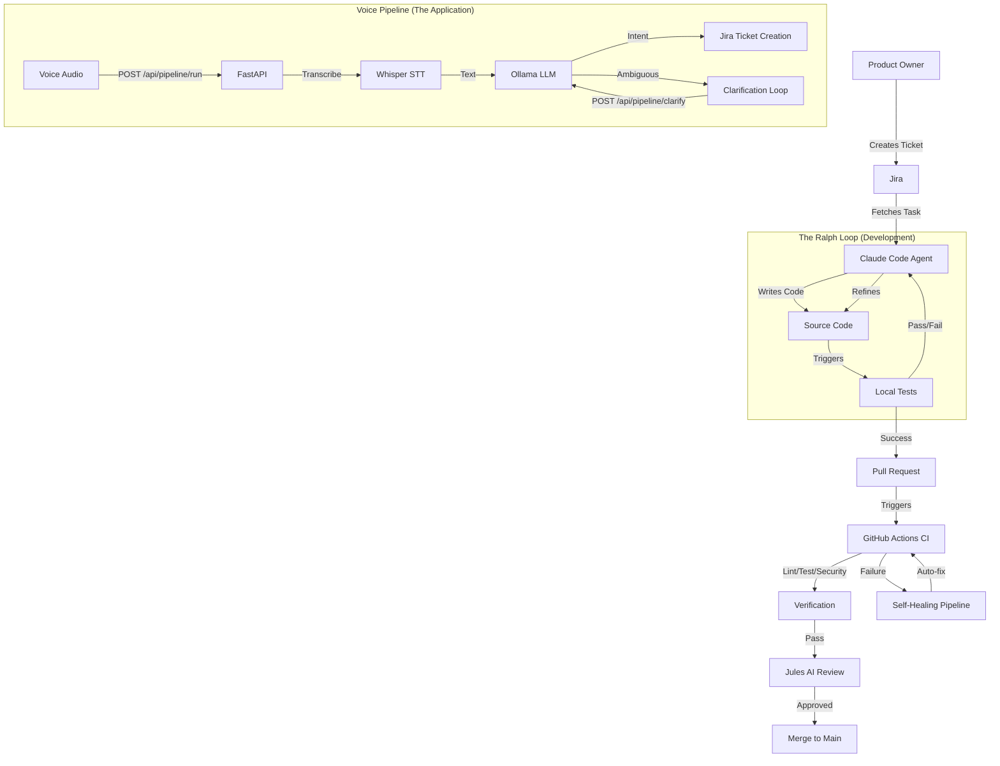

# SEJFA - Voice-to-Jira Pipeline with Agentic DevOps Loop

[](https://www.python.org/)
[](https://fastapi.tiangolo.com/)
[](https://www.atlassian.com/software/jira)
[](https://github.com/your-org/sejfa)
[](LICENSE)

> **"From Jira Ticket to Production -- Untouched by Human Hands."**

---

## About SEJFA

SEJFA is a cutting-edge **Agentic DevOps Loop System**, meticulously crafted by **Filippa, Simon, Jonas O, Emma, and Annika**. This project is a living demonstration of the future of software development: a fully autonomous workflow where AI Agents (powered by **Claude Code** and **Ralph Wiggum Loops**) take ownership of the entire lifecycle -- from picking up a Jira ticket to deploying a production-ready application.

The application under development is a **Voice-to-Jira Pipeline**: a FastAPI service that accepts voice audio, transcribes it with Whisper, extracts Jira intent via Ollama, and creates tickets automatically -- including an ambiguity clarification loop for unclear requests.

### Ideally Suited For:
- **Autonomous Development:** Exploring the limits of AI-driven coding.
- **Enterprise Integration:** Seamlessly connecting Jira, GitHub, and CI/CD.
- **Voice-Driven Workflows:** Turning spoken words into structured Jira tickets.

---

## Key Features

| Feature | Description |
| :--- | :--- |
| **Agentic Workflow** | Autonomous task execution with `start-task` and `finish-task` commands, powered by Claude Code. |
| **Ralph Loop** | A rigorous TDD cycle: Red -> Green -> Refactor -> Verify. Quality is non-negotiable. |
| **Voice Pipeline** | FastAPI service: audio transcription (Whisper) -> intent extraction (Ollama) -> Jira ticket creation. |
| **Jira Integration** | Direct two-way sync with Jira. Tickets are fetched, updated, and closed automatically. |
| **Self-Healing CI** | GitHub Actions pipeline that auto-fixes failures (max 3 retries). |
| **Jules AI Review** | Automated code review on pull requests via Jules integration. |
| **Real-Time Status** | WebSocket endpoint for live pipeline status updates. |

---

## Architecture

The SEJFA system has two layers: the **Agentic DevOps Loop** (the development infrastructure) and the **Voice Pipeline** (the application being developed).



---

## Getting Started

Follow these steps to set up your own Agentic DevOps environment.

### Prerequisites

- **Python 3.11+**
- **Docker** (for local container testing)
- **Jira Account** (API token required for agent integration)
- **Ollama** (for local LLM intent extraction)
- **Whisper model** (downloaded automatically by faster-whisper)

### Installation

1. **Clone the Repository**
   ```bash
   git clone <repository-url>
   cd agentic-devops-loop
   ```

2. **Set Up Virtual Environment**
   ```bash
   python -m venv venv
   source venv/bin/activate  # Windows: venv\Scripts\activate
   ```

3. **Install Dependencies**
   ```bash
   pip install -r requirements.txt
   ```

4. **Configure Environment**
   Copy `.env.example` to `.env` and fill in your values:
   ```bash
   cp .env.example .env
   ```

   Key configuration:
   - `JIRA_URL`, `JIRA_EMAIL`, `JIRA_API_TOKEN`, `JIRA_PROJECT_KEY` -- Jira credentials
   - `OLLAMA_MODEL`, `OLLAMA_URL` -- Ollama LLM configuration
   - `WHISPER_MODEL`, `WHISPER_DEVICE` -- Whisper transcription settings

### Running the Application

Start the FastAPI development server:
```bash
source venv/bin/activate && uvicorn src.voice_pipeline.main:app --host 0.0.0.0 --port 8000 --reload
```
Access the application at `http://localhost:8000`.

Health check: `http://localhost:8000/health`

### Remote Workflow (Mac App + ai-server2 Backend)

If your voice app runs on macOS and the heavy backend runs on `ai-server2`, use:

```bash
bash scripts/remote-dev-shell.sh ai-server2 /home/ai-server2/04-voice-mode-4-loop coffeedev
```

This opens a persistent `tmux` dev shell on `ai-server2` and bootstraps a reverse tunnel so your Mac can call backend APIs through `http://localhost:8000`.

For manual tunnel control and persistent service setup, see:
- `docs/REMOTE_DEV.md`

### Running with Docker

```bash
docker build -t sejfa-voice-pipeline .
docker run -p 8000:8000 --env-file .env sejfa-voice-pipeline
```

### Running Tests

Verify the system integrity with `pytest`:
```bash
source venv/bin/activate && pytest tests/ -xvs
```

---

## API Endpoints

| Endpoint | Method | Description |
|----------|--------|-------------|
| `/health` | GET | Health check |
| `/api/transcribe` | POST | Transcribe audio file to text (Whisper) |
| `/api/extract` | POST | Extract Jira intent from text (Ollama) |
| `/api/pipeline/run` | POST | Full pipeline: audio -> text -> intent -> Jira |
| `/api/pipeline/clarify` | POST | Handle clarification response in ambiguity loop |
| `/ws/status` | WS | WebSocket for real-time pipeline status updates |

---

## Agentic Development Guide

Unlock the power of autonomous coding with the **Ralph Skills** in `.claude/skills`.

### 1. Start a Task
Initialize a new task from a Jira ticket. This sets up the branch and context.
```bash
claude -i start-task <JIRA-ID>
```

### 2. The Ralph Loop
The agent enters the loop:
- **Red:** Write a failing test.
- **Green:** Implement the solution.
- **Refactor:** Optimize code.
- **Verify:** Run linting and security checks.

### 3. Finish Task
Once the loop is complete and all checks pass:
```bash
claude -i finish-task
```
This pushes the changes, creates a PR, and updates the Jira ticket.

---

## Project Structure

```
.
├── .claude/                # Agent Configuration & Skills
│   ├── hooks/              # Git/Loop Hooks (stop-hook)
│   ├── commands/           # Slash commands (start-task, finish-task, preflight)
│   ├── skills/             # Agent Skills
│   ├── plugins/            # MCP server configurations
│   └── utils/              # Helper utilities (sanitize, preflight)
├── .github/workflows/      # CI/CD Pipelines
│   ├── ci.yml              # Lint, test, build
│   ├── pr-validation.yml   # PR title/branch validation
│   ├── jules-review.yml    # AI code review
│   └── self-healing.yml    # Auto-fix on CI failure
├── .githooks/              # Local Git Hooks (commit-msg, pre-push)
├── src/
│   ├── voice_pipeline/     # FastAPI Voice-to-Jira Pipeline
│   │   ├── main.py         # FastAPI app entry point
│   │   ├── config.py       # Pipeline configuration
│   │   ├── transcriber/    # Whisper speech-to-text
│   │   ├── intent/         # Ollama intent extraction
│   │   ├── jira/           # Jira ticket creation
│   │   ├── pipeline/       # Pipeline orchestration
│   │   └── security/       # Input validation
│   └── sejfa/              # Shared Utilities
│       ├── integrations/   # Jira API client
│       ├── monitor/        # Monitor service
│       └── utils/          # Security utilities
├── tests/                  # Test Suite
│   ├── voice_pipeline/     # Voice pipeline tests (64 tests)
│   ├── agent/              # Agent/loop tests
│   ├── integrations/       # Integration tests
│   └── utils/              # Utility tests
├── scripts/                # Helper Scripts (Jules, CI)
├── docs/                   # Documentation
├── Dockerfile              # Production image (uvicorn, port 8000)
├── docker-compose.yml      # Container orchestration
├── pyproject.toml          # FastAPI deps, ruff, pytest config
└── requirements.txt        # Pinned dependencies
```

---

## Documentation

- **[Agentic DevOps Loop Guide](docs/AGENTIC_DEVOPS_LOOP.md)** - Comprehensive guide covering the loop architecture and workflows.
- **[Jules Playbook](docs/jules-playbook.md)** - Insights into the AI review system.
- **[Agent Guidelines](docs/GUIDELINES.md)** - Detailed agent behavior reference.
- **[Quick Start](docs/QUICKSTART.md)** - Setup guide.
- **[Remote Dev Workflow](docs/REMOTE_DEV.md)** - One-command SSH + reverse tunnel workflow (Mac + ai-server2).

---

## Contributing

We welcome contributions! Please follow the **Ralph Loop** methodology:
1. Fork the repository.
2. Create a feature branch (`feature/DEV-XXX-description`).
3. Ensure all tests pass.
4. Submit a Pull Request.

See [CONTRIBUTING.md](CONTRIBUTING.md) for details.

---

## License

This project is licensed under the MIT License - see the [LICENSE](LICENSE) file for details.

---

*Built with love by the SEJFA Team.*
