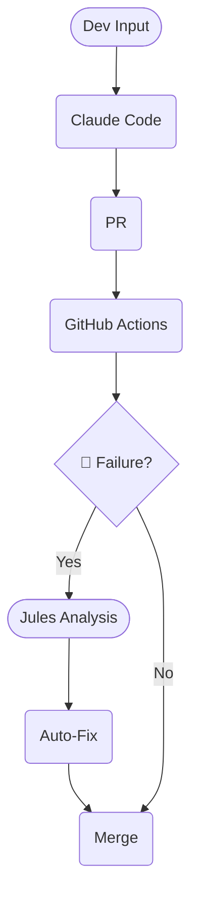

# Agentic Dev Loop 🚀

> **The Infinite Loop of Autonomous Creation**
> *Where Claude builds, Jules heals, and code writes itself.*


[](/.github/workflows/jules-review.yml)
[](https://docs.anthropic.com/en/docs/agents-and-tools/claude-code/overview)
[](LICENSE)
[](https://github.com/itsimonfredlingjack)

---

## 🌟 What is the Agentic Dev Loop Magic?

Welcome to the future of software engineering. This isn't just a repository; it's a **Cybernetic Development Ecosystem**.

We have fused **Claude Code (Ralph)**—the relentless builder—with **Google Jules**—the omniscient guardian—to create a self-sustaining loop of creation. You drop a Jira ticket, and the system springs to life: coding, testing, reviewing, and **fixing its own mistakes**.

It is **Self-Healing Infrastructure** meets **Autonomous Velocity**. 🦾💜⚡

---

## 🏗️ The Autonomous Flow



---

## 🔥 Key Features

| Feature | Benefit |
|---------|---------|
| 🤖 **Self-Healing Pipelines** | **Jules** detects CI failures (linting, tests) and hot-patches the code automatically. Zero human latency. |
| ⚡ **The Infinite Loop** | A perpetual engine of productivity: Jira Ticket ➡️ Claude Dev ➡️ PR ➡️ Jules Review ➡️ Merge. |
| 🛡️ **AI Security Guardrails** | Built-in protection against prompt injection and unsafe package installs. **Jules** watches the watchmen. |
| 🧠 **Persistent Memory** | The **Ralph Loop** remembers context across sessions via `CURRENT_TASK.md`. It never forgets. |
| 🚀 **Next-Gen Velocity** | Skip the boilerplate. Focus on the architecture while the agents handle the implementation details. |

---

## 🚀 Launch the Beast

Initialize the autonomous core.

### 1. Clone the Matrix
```bash
git clone https://github.com/itsimonfredlingjack/agentic-dev-loop-w-claude-code-and-github-actions.git
cd agentic-dev-loop-w-claude-code-and-github-actions
```

### 2. Inject Credentials
```bash
cp .env.example .env
# Open .env and insert your JIRA_API_TOKEN and Agent Secrets
```

### 3. Arm the Hooks
```bash
./scripts/setup-hooks.sh
```

### 4. Ignite the Engine
```bash
claude
# Inside the session: /start-task PROJ-123
```

---

## 📁 Directory Structure

```
agentic-dev-loop/
├── .claude/               # 🧠 The Brain (Ralph Config & Memory)
│   ├── hooks/             # Security enforcement protocols
│   └── plugins/           # MCP Integrations
├── .github/workflows/     # ⚡ The Nervous System
│   ├── jules-review.yml   # AI Code Reviewer
│   └── self-healing.yml   # Auto-Remediation Logic
├── docs/                  # 📜 Knowledge Base
│   ├── CURRENT_TASK.md    # Active Working Memory
│   └── monitor/           # Real-time Status Dashboard
├── document_upload_app/   # 📦 Sample Workload
├── scripts/               # 🛠️ Utility Belts
└── src/                   # 🧬 Source Code
```

---

## 🤝 Join the Revolution

<div align="center">

**[⭐ Star this Repo](https://github.com/itsimonfredlingjack/agentic-dev-loop-w-claude-code-and-github-actions)**

*Architected for Dominance. Built for 2077.*

</div>

<!-- Tracking: [PROJ-123] v2 -->
