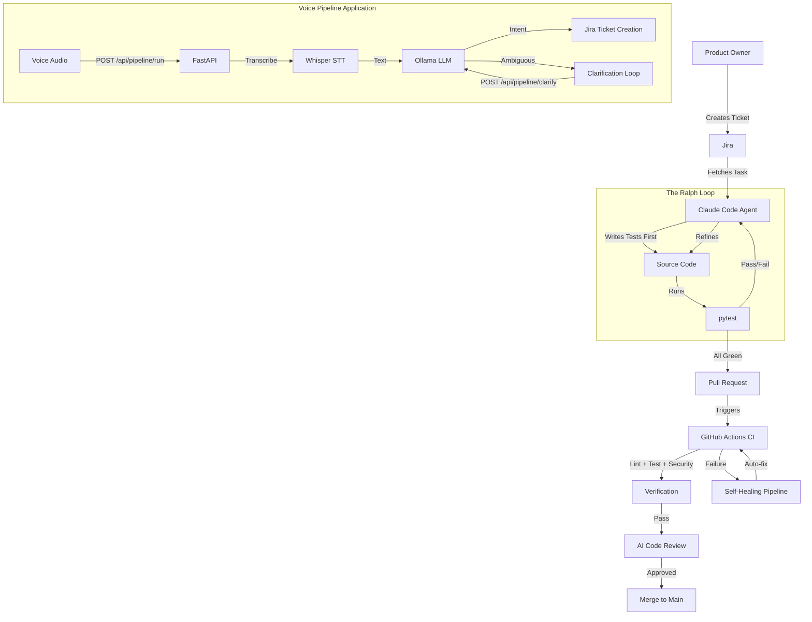

# Agentic DevOps Loop

[](https://www.python.org/)
[](https://fastapi.tiangolo.com/)
[](https://docs.anthropic.com/en/docs/claude-code)
[](https://www.atlassian.com/software/jira)
[](https://github.com/features/actions)

> **From Jira ticket to merged PR — untouched by human hands.**

---

## What Is This?

An **autonomous development system** that picks up Jira tickets, writes code with TDD, runs CI, requests AI code review, and merges — all without manual intervention.

This project started as a short school project and has since evolved into a full-scale exploration of what agentic software development can look like in practice. Built and maintained by **Simon Fredling Jack**.

```
Jira Ticket → Claude Code (Ralph Loop) → GitHub Actions → AI Code Review → Merge
```

The application being developed inside this loop is a **Voice-to-Jira Pipeline**: a FastAPI service that accepts voice audio, transcribes it with Whisper, extracts intent via Ollama, and creates Jira tickets automatically — including an ambiguity clarification loop for unclear requests.

---

## Key Features

| Feature | Description |
| :--- | :--- |
| **Agentic Workflow** | Autonomous task execution with `start-task` and `finish-task` skills, powered by Claude Code. |
| **Ralph Loop** | A persistent TDD cycle: Red → Green → Refactor → Verify. The agent keeps iterating until all acceptance criteria are met. |
| **Voice Pipeline** | FastAPI service: audio transcription (Whisper) → intent extraction (Ollama) → Jira ticket creation. |
| **Jira Integration** | Two-way sync with Jira. Tickets are fetched, status is transitioned, and comments are posted automatically. |
| **Self-Healing CI** | GitHub Actions pipeline that detects failures and triggers automatic fix attempts (max 3 retries). |
| **AI Code Review** | Automated code review on pull requests via Jules integration. |
| **Real-Time Status** | WebSocket endpoint for live pipeline status updates. |
| **Security Hooks** | Pre-tool-use validation, package allowlists, and prompt injection protection built in. |

---

## Architecture

The system has two layers: the **Agentic DevOps Loop** (the development infrastructure) and the **Voice Pipeline** (the application being developed).



---

## Getting Started

### Prerequisites

- **Python 3.11+**
- **Docker** (optional, for containerized runs)
- **Jira Account** with an API token
- **Ollama** (for local LLM intent extraction)

### Installation

```bash
# Clone the repository
git clone https://github.com/itsimonfredlingjack/agentic-devops-loop.git
cd agentic-devops-loop

# Set up virtual environment
python -m venv venv
source venv/bin/activate

# Install dependencies
pip install -r requirements.txt

# Configure environment variables
cp .env.example .env
# Edit .env with your Jira, Ollama, and Whisper settings
```

### Running the Application

```bash
source venv/bin/activate
uvicorn src.voice_pipeline.main:app --host 0.0.0.0 --port 8000 --reload
```

The API is available at `http://localhost:8000`. Health check: `GET /health`.

### Running with Docker

```bash
docker build -t agentic-devops-loop .
docker run -p 8000:8000 --env-file .env agentic-devops-loop
```

### Running Tests

```bash
source venv/bin/activate
pytest tests/ -xvs
```

---

## API Endpoints

| Endpoint | Method | Description |
| :--- | :--- | :--- |
| `/health` | `GET` | Health check |
| `/api/transcribe` | `POST` | Transcribe audio to text (Whisper) |
| `/api/extract` | `POST` | Extract Jira intent from text (Ollama) |
| `/api/pipeline/run` | `POST` | Full pipeline: audio → text → intent → Jira ticket |
| `/api/pipeline/clarify` | `POST` | Handle clarification in the ambiguity loop |
| `/ws/status` | `WS` | WebSocket for real-time pipeline status |

---

## Agentic Development

The autonomous development workflow is driven by Claude Code skills and a persistent loop.

### 1. Start a Task

Fetch a Jira ticket, create a feature branch, and initialize task context:

```
/start-task <JIRA-ID>
```

### 2. The Ralph Loop

The agent enters a TDD loop and keeps iterating until all acceptance criteria are met:

1. **Red** — Write a failing test
2. **Green** — Write minimal code to make it pass
3. **Refactor** — Clean up without breaking tests
4. **Verify** — Run linting and full test suite

Progress is tracked in `docs/CURRENT_TASK.md`, which serves as persistent memory across iterations.

### 3. Finish Task

Once every acceptance criterion is met and all checks pass:

```
/finish-task
```

This commits, pushes, creates a PR, and transitions the Jira ticket — all automatically.

---

## Project Structure

```
.
├── .claude/                          # Claude Code agent configuration
│   ├── commands/                     # Slash commands (start-task, finish-task, preflight)
│   ├── hooks/                        # Security & loop hooks
│   │   ├── pre-tool-use.py           #   Package & command validation
│   │   ├── post-tool-use.py          #   Post-execution checks
│   │   ├── stop-hook.py              #   Ralph loop exit control
│   │   ├── prevent-push.py           #   Block direct push to main
│   │   ├── monitor_hook.py           #   Real-time loop monitoring
│   │   └── monitor_client.py         #   SocketIO dashboard client
│   ├── skills/                       # Agent skills (start-task, finish-task)
│   ├── plugins/                      # MCP server configurations
│   ├── utils/                        # Helpers (sanitize, preflight, Jira API, smart commit)
│   ├── settings.json                 # Hook & permission config
│   ├── ralph-config.json             # Loop exit policy & profiles
│   └── package-allowlist.json        # Approved packages for installation
│
├── .github/                          # GitHub configuration
│   ├── CODEOWNERS                    # Protected file rules
│   ├── PULL_REQUEST_TEMPLATE.md      # PR template
│   └── workflows/
│       ├── ci.yml                    # Lint, test, build pipeline
│       ├── pr-validation.yml         # PR title & branch validation
│       ├── jules-review.yml          # AI code review
│       ├── self-healing.yml          # Auto-fix on CI failure
│       ├── pages.yml                 # GitHub Pages deployment
│       └── cleanup-branches.yml      # Stale branch cleanup
│
├── .githooks/                        # Local git hooks
│   ├── commit-msg                    # Validates JIRA-ID: format
│   ├── pre-push                      # Validates branch naming
│   └── post-commit                   # Post-commit automation
│
├── src/
│   ├── voice_pipeline/               # FastAPI Voice-to-Jira Pipeline
│   │   ├── main.py                   # App entry point (uvicorn)
│   │   ├── config.py                 # Pipeline configuration
│   │   ├── transcriber/              # Whisper speech-to-text
│   │   │   ├── whisper_local.py      #   Local Whisper model
│   │   │   └── openai_api.py         #   OpenAI Whisper API
│   │   ├── intent/                   # Intent extraction (Ollama)
│   │   │   ├── extractor.py          #   Core extraction logic
│   │   │   ├── models.py             #   Data models
│   │   │   └── prompts.py            #   LLM prompt templates
│   │   ├── jira/                     # Jira ticket creation
│   │   │   ├── client.py             #   Jira API client
│   │   │   └── formatter.py          #   Ticket formatting
│   │   ├── pipeline/                 # Orchestration
│   │   │   ├── orchestrator.py       #   Pipeline coordinator
│   │   │   └── status.py             #   Status tracking
│   │   └── security/                 # Input validation
│   │       └── sanitizer.py          #   Input sanitization
│   └── sejfa/                        # Shared utilities
│       ├── integrations/             # Jira API client
│       ├── monitor/                  # Loop monitor service
│       └── utils/                    # Security & health utilities
│
├── tests/                            # Test suite
│   ├── voice_pipeline/               # Pipeline unit tests
│   ├── agent/                        # Agent & hook tests
│   ├── integrations/                 # Jira integration tests
│   └── utils/                        # Utility tests
│
├── scripts/                          # Helper scripts
│   ├── setup-hooks.sh                # Install git hooks
│   ├── create-branch.sh              # Branch creation
│   ├── create-pr.sh                  # PR creation
│   └── ...                           # CI, Jules, and review helpers
│
├── docs/                             # Documentation
│   ├── AGENTIC_DEVOPS_LOOP.md        # Full loop architecture guide
│   ├── GUIDELINES.md                 # Agent behavior reference
│   ├── QUICKSTART.md                 # Setup guide
│   ├── jules-playbook.md             # AI review playbook
│   └── JULES_INTEGRATION.md          # Jules integration details
│
├── Dockerfile                        # Production image (uvicorn, port 8000)
├── docker-compose.yml                # Container orchestration
├── pyproject.toml                    # Dependencies, ruff & pytest config
├── requirements.txt                  # Pinned dependencies
└── CONTRIBUTING.md                   # Contribution guidelines
```

---

## CI/CD Pipelines

| Workflow | Trigger | Purpose |
| :--- | :--- | :--- |
| `ci.yml` | Push / PR to main | Lint, test, build, type-check |
| `pr-validation.yml` | PR opened / edited | Validate title, branch, and commit format |
| `jules-review.yml` | PR opened | AI-powered code review |
| `self-healing.yml` | CI failure | Automatic fix attempts (max 3 retries) |
| `pages.yml` | Push to main | Deploy documentation to GitHub Pages |
| `cleanup-branches.yml` | Scheduled | Remove stale branches |

---

## Documentation

- [Agentic DevOps Loop Guide](docs/AGENTIC_DEVOPS_LOOP.md) — Full architecture and operational documentation
- [Agent Guidelines](docs/GUIDELINES.md) — Agent behavior, TDD patterns, and troubleshooting
- [Quick Start](docs/QUICKSTART.md) — Setup guide
- [Jules Playbook](docs/jules-playbook.md) — AI code review system
- [Jules Integration](docs/JULES_INTEGRATION.md) — Technical integration details
- [Contributing](CONTRIBUTING.md) — How to contribute

---

## Tech Stack

| Layer | Technology |
| :--- | :--- |
| **Application** | Python 3.11+, FastAPI, Uvicorn |
| **Speech-to-Text** | Whisper (local + OpenAI API) |
| **Intent Extraction** | Ollama (local LLM) |
| **Project Management** | Jira (REST API) |
| **AI Agent** | Claude Code with custom skills and hooks |
| **CI/CD** | GitHub Actions (with self-healing) |
| **Code Review** | Jules AI |
| **Containerization** | Docker |
| **Code Quality** | Ruff, pytest, mypy |

---

## Background

This project began as a short school project exploring CI/CD automation. It has since grown into a full autonomous development system — an experiment in how far you can push AI-driven software engineering with real-world integrations.

The core question: *Can an AI agent autonomously pick up a Jira ticket, write tested code, pass CI, get reviewed, and merge — without a human touching the keyboard?*

This repo is the answer.

---

*Built by [Simon Fredling Jack](https://github.com/itsimonfredlingjack)*
