# Agentic Dev Loop 🚀

> **The Infinite Loop of Autonomous Creation**
> *Where Claude builds, Jules heals, and code writes itself.*


[](/.github/workflows/jules-review.yml)
[](https://docs.anthropic.com/en/docs/agents-and-tools/claude-code/overview)
[](LICENSE)
[](https://github.com/itsimonfredlingjack)

---

## 🌟 What is the Agentic Dev Loop Magic?

Welcome to the future of software engineering. This isn't just a repository; it's a **Cybernetic Development Ecosystem**.

We have fused **Claude Code (Ralph)**—the relentless builder—with **Google Jules**—the omniscient guardian—to create a self-sustaining loop of creation. You drop a Jira ticket, and the system springs to life: coding, testing, reviewing, and **fixing its own mistakes**.

It is **Self-Healing Infrastructure** meets **Autonomous Velocity**. 🦾💜⚡

---

## 🏗️ The Autonomous Flow

```mermaid
graph TD
    A([Dev Input]) --> B(Claude Code)
    B --> C(PR)
    C --> D(GitHub Actions)
    D --> E{👀 Failure?}
    E -->|Yes| F([Jules Analysis])
    F --> G(Auto-Fix)
    G --> H(Merge)
    E -->|No| H
```



---

## 🔥 Key Features

| Feature | Benefit |
|---------|---------|
| 🤖 **Self-Healing Pipelines** | **Jules** detects CI failures (linting, tests) and hot-patches the code automatically. Zero human latency. |
| ⚡ **The Infinite Loop** | A perpetual engine of productivity: Jira Ticket ➡️ Claude Dev ➡️ PR ➡️ Jules Review ➡️ Merge. |
| 🧪 **TDD-First Flask** | Pre-configured environment (Ralph Config & Allowlist) for generating robust, test-driven Flask applications. |
| 🛡️ **AI Security Guardrails** | Built-in protection against prompt injection and unsafe package installs. **Jules** watches the watchmen. |
| 🧠 **Persistent Memory** | The **Ralph Loop** remembers context across sessions via `CURRENT_TASK.md`. It never forgets. |
| 🚀 **Next-Gen Velocity** | Skip the boilerplate. Focus on the architecture while the agents handle the implementation details. |

---

## 🚀 Launch the Beast

Initialize the autonomous core.

### 1. Clone the Matrix
```bash
git clone https://github.com/itsimonfredlingjack/agentic-dev-loop-w-claude-code-and-github-actions.git
cd agentic-dev-loop-w-claude-code-and-github-actions
```

### 2. Inject Credentials
```bash
cp .env.example .env
# Open .env and insert your JIRA_API_TOKEN and Agent Secrets
```

### 3. Arm the Hooks
```bash
./scripts/setup-hooks.sh
```

### 4. Ignite the Engine
```bash
claude
# Inside the session: /start-task PROJ-123
```

---

## 📁 Directory Structure

```
agentic-dev-loop/
├── .claude/               # 🧠 The Brain (Ralph Config & Memory)
│   ├── hooks/             # Security enforcement protocols
│   └── plugins/           # MCP Integrations
├── .github/workflows/     # ⚡ The Nervous System
│   ├── jules-review.yml   # AI Code Reviewer
│   └── self-healing.yml   # Auto-Remediation Logic
├── docs/                  # 📜 Knowledge Base
│   ├── CURRENT_TASK.md    # Active Working Memory
│   ├── jira-ticket-template-flask-tdd.md # 📋 Flask TDD Template
│   └── monitor/           # Real-time Status Dashboard
├── document_upload_app/   # 📦 Sample Workload
├── scripts/               # 🛠️ Utility Belts
└── src/                   # 🧬 Source Code
```

---

## 🧪 Agentic Workloads: Flask TDD

The Ralph Loop is now primed to generate Test-Driven Flask applications. We have pre-configured the environment (`.claude/package-allowlist.json` and `.claude/ralph-config.json`) so you can start immediately.

### 📋 The Golden Ticket Template

Copy the text below into your Jira ticket to trigger the loop.

<details open>
<summary><b>Reusable Template (Click to Collapse)</b></summary>

### Title

```
Build [APP_NAME] Flask-skelett med TDD
```

### Description

```
h2. Uppdrag

Bygg ett komplett Flask-appskelett for *[APP_NAME]* med test-driven utveckling.
Prioritet 1 ar TESTER. Prioritet 2 ar minimal kod som far testerna att ga grona.
Ingen extra design, ingen feature creep.

Sprak: Python-identifierare och kommentarer pa engelska.
Anvandardtext (templates, felmeddelanden, formularlabels): svenska.

h2. Arkitektur (fast -- andra ej)

Folj dessa monster exakt:

* Application factory: `create_app(config_name)` i `app/__init__.py`
* Trelagersarkitektur:
** `app/data/` -- Modell(er) som dataclass eller SQLAlchemy, Repository-protokoll plus InMemoryRepository
** `app/business/` -- Service-klass med repository injicerad via konstruktor
** `app/presentation/` -- Blueprint med routes och Jinja2-templates
* Dependency injection: Service far repository via `__init__(self, repository)`. Routes far service via `app.config`-factory
* Config-klasser: Development, Testing (sqlite memory, TESTING=True), Production
* Testing-konfiguration anvander `sqlite:///:memory:` och TESTING=True

h2. [ADJUST] Modellspecifikation

*Modell:* [MODEL_NAME]
*Falt:*
[FIELDS_AS_BULLET_LIST]

h2. [ADJUST] Affarsregler

*Service:* [SERVICE_NAME]
*Regler:*
[RULES_AS_BULLET_LIST]

*Felmeddelanden (svenska):*
[ERROR_MESSAGES_AS_BULLET_LIST]

h2. [ADJUST] Routes

| Metod | Stig | Beteende |
| GET | [ROUTE_PATH] | [GET_BEHAVIOR] |
| POST | [ROUTE_PATH] | [POST_BEHAVIOR] |

*Templates:*
* base.html -- gemensam layout, svensk titel
* [TEMPLATE_1] -- [TEMPLATE_1_DESCRIPTION]
* [TEMPLATE_2] -- [TEMPLATE_2_DESCRIPTION]

h2. Acceptance Criteria

- [ ] Projektstruktur skapad med app/, tests/, config.py, requirements.txt
- [ ] create_app() returnerar konfigurerad Flask-instans
- [ ] Testing-config anvander sqlite:///:memory: och TESTING=True
- [ ] [MODEL_NAME]-modell definierad med falt: [SHORT_FIELD_LIST]
- [ ] Repository-protokoll definierat med metoder: [REPO_METHOD_LIST]
- [ ] InMemoryRepository implementerar protokollet
- [ ] [SERVICE_NAME] skapad med repository-DI via konstruktor
- [ ] [SERVICE_NAME] tillampar alla affarsregler fran specifikationen
- [ ] [ROUTE_DESCRIPTION_1]
- [ ] [ROUTE_DESCRIPTION_2]
- [ ] Templates med svenska texter och gemensam base.html
- [ ] Unit-tester taacker alla affarsregler med InMemoryRepository
- [ ] Integrationstester verifierar routes med Flask test client
- [ ] pytest -xvs passerar utan fel
- [ ] ruff check . passerar utan fel

h2. [ADJUST] Testscenarier

h3. Enhetstester (business-lager, InMemoryRepository)

| # | Scenario | Given | When | Then |
[UNIT_TEST_TABLE_ROWS]

h3. Integrationstester (Flask test client)

| # | Scenario | Anrop | Forvantad status | Forvantad innehall |
[INTEGRATION_TEST_TABLE_ROWS]

h2. Projektstruktur (mal)

{noformat}
app/
  __init__.py          # create_app factory
  config.py
  business/
    __init__.py
    [service_file].py
  data/
    __init__.py
    models/
      __init__.py
      [model_file].py
    repositories/
      __init__.py
      [repo_file].py
  presentation/
    __init__.py
    routes/
      __init__.py
      [routes_file].py
    templates/
      base.html
      [template_files]
tests/
  conftest.py
  unit/
    [unit_test_file].py
  integration/
    [integration_test_file].py
config.py
requirements.txt
{noformat}
```

</details>

### 🧩 Examples & Variations

<details>
<summary><b>Example: News Flash (Subscription App)</b></summary>

### Jira Title

```
Build News Flash Flask-skelett med TDD
```

### Jira Description

```
h2. Uppdrag

Bygg ett komplett Flask-appskelett for *News Flash* -- en prenumerationssida for nyhetsbrev -- med test-driven utveckling.
Prioritet 1 ar TESTER. Prioritet 2 ar minimal kod som far testerna att ga grona.
Ingen extra design, ingen feature creep.

Sprak: Python-identifierare och kommentarer pa engelska.
Anvandardtext (templates, felmeddelanden, formularlabels): svenska.

h2. Arkitektur (fast -- andra ej)

Folj dessa monster exakt:

* Application factory: `create_app(config_name)` i `app/__init__.py`
* Trelagersarkitektur:
** `app/data/` -- Modell(er) som dataclass eller SQLAlchemy, Repository-protokoll plus InMemoryRepository
** `app/business/` -- Service-klass med repository injicerad via konstruktor
** `app/presentation/` -- Blueprint med routes och Jinja2-templates
* Dependency injection: Service far repository via `__init__(self, repository)`. Routes far service via `app.config`-factory
* Config-klasser: Development, Testing (sqlite memory, TESTING=True), Production
* Testing-konfiguration anvander `sqlite:///:memory:` och TESTING=True

h2. Modellspecifikation

*Modell:* Subscriber
*Falt:*
* email (str, unik, obligatorisk, indexerad)
* name (str, valfri, default None)
* subscribed_at (datetime, auto-satt till UTC nu)

h2. Affarsregler

*Service:* SubscriptionService
*Regler:*
* E-post maste valideras med regex (innehalla @ och giltig doman)
* E-post normaliseras: strip whitespace, lowercase
* Namn normaliseras: strip whitespace, default "Prenumerant" om tomt
* Dubblett-e-post avvisas (case-insensitive)
* Tom e-post avvisas

*Felmeddelanden (svenska):*
* Tom e-post: "E-postadress ar obligatorisk."
* Ogiltigt format: "Ogiltigt e-postformat."
* Dubblett: "Denna e-postadress ar redan registrerad."

h2. Routes

| Metod | Stig | Beteende |
| GET | /subscribe | Visar prenumerationsformular |
| POST | /subscribe | Bearbetar formularet, visar tack-sida vid lyckad prenumeration, visar formular med felmeddelande vid fel |

*Templates:*
* base.html -- gemensam layout med "News Flash" som titel
* subscribe.html -- formular med e-post (obligatoriskt) och namn (valfritt)
* thank_you.html -- bekraftelsesida med namn och e-postadress

h2. Acceptance Criteria

- [ ] Projektstruktur skapad med app/, tests/, config.py, requirements.txt
- [ ] create_app() returnerar konfigurerad Flask-instans
- [ ] Testing-config anvander sqlite:///:memory: och TESTING=True
- [ ] Subscriber-modell definierad med falt: email (unik), name (valfri), subscribed_at (auto)
- [ ] Repository-protokoll definierat med metoder: add, get_by_email, exists_by_email
- [ ] InMemoryRepository implementerar protokollet
- [ ] SubscriptionService skapad med repository-DI via konstruktor
- [ ] SubscriptionService tillampar alla affarsregler: validering, normalisering, dubblettcheck
- [ ] GET /subscribe renderar subscribe.html med svenskt formular
- [ ] POST /subscribe renderar thank_you.html vid lyckad prenumeration
- [ ] POST /subscribe renderar subscribe.html med svenskt felmeddelande vid ogiltigt input
- [ ] Templates med svenska texter och gemensam base.html
- [ ] Unit-tester taacker alla affarsregler med InMemoryRepository
- [ ] Integrationstester verifierar routes med Flask test client
- [ ] pytest -xvs passerar utan fel
- [ ] ruff check . passerar utan fel

h2. Testscenarier

h3. Enhetstester (business-lager, InMemoryRepository)

| # | Scenario | Given | When | Then |
| U1 | Tom e-post avvisas | tom repo | subscribe med email="" | False, felmeddelande innehaller "obligatorisk" |
| U2 | Ogiltigt e-postformat avvisas | tom repo | subscribe med email="inte-en-epost" | False, felmeddelande innehaller "ogiltigt" |
| U3 | E-post normaliseras och namn far default | tom repo | subscribe med email="  Test@Example.COM  ", name="   " | True, email="test@example.com", name="Prenumerant" |
| U4 | Dubblett avvisas case-insensitive | repo har "a@b.com" | subscribe med email="A@B.COM" | False, felmeddelande innehaller "redan" |
| U5 | Lyckad prenumeration | tom repo | subscribe med email="anna@example.com", name="Anna" | True, subscriber lagrad med korrekt email och namn |

h3. Integrationstester (Flask test client)

| # | Scenario | Anrop | Forvantad status | Forvantad innehall |
| I1 | Visa formular | GET /subscribe | 200 | "Prenumerera" i HTML |
| I2 | Lyckad prenumeration | POST /subscribe med valid email | 200 | "Tack" i HTML |
| I3 | Ogiltigt e-postformat | POST /subscribe med email="bad" | 200 | "ogiltigt" (case-insensitive) i HTML |
| I4 | Dubblett-e-post | POST /subscribe tva ganger med samma email | 200 | "redan" (case-insensitive) i HTML |

h2. Projektstruktur (mal)

{noformat}
app/
  __init__.py
  business/
    __init__.py
    subscription_service.py
  data/
    __init__.py
    models/
      __init__.py
      subscriber.py
    repositories/
      __init__.py
      subscriber_repository.py
  presentation/
    __init__.py
    routes/
      __init__.py
      public.py
    templates/
      base.html
      subscribe.html
      thank_you.html
tests/
  conftest.py
  unit/
    test_subscription_service.py
  integration/
    test_public_routes.py
config.py
requirements.txt
{noformat}
```
</details>

<details>
<summary><b>Variation: Att-Gora (Todo-lista)</b></summary>

### Jira Title

```
Build Att-Gora Flask-skelett med TDD
```

### Changed sections (replace in template)

```
h2. Modellspecifikation

*Modell:* TodoItem
*Falt:*
* id (int, auto-genererad)
* title (str, obligatorisk, max 200 tecken)
* done (bool, default False)
* created_at (datetime, auto-satt till UTC nu)

h2. Affarsregler

*Service:* TodoService
*Regler:*
* Titel ar obligatorisk, far inte vara tom eller bara whitespace
* Titel far vara max 200 tecken
* Markera som klar/inte klar (toggle)
* Ta bort uppgift via id

*Felmeddelanden (svenska):*
* Tom titel: "Titel far inte vara tom."
* For lang titel: "Titel far vara max 200 tecken."

h2. Routes

| Metod | Stig | Beteende |
| GET | /todos | Visar alla uppgifter med formular for att lagga till ny |
| POST | /todos | Laggar till ny uppgift, redirectar till GET /todos |
| POST | /todos/<id>/toggle | Toggler klar-status, redirectar till GET /todos |
| POST | /todos/<id>/delete | Tar bort uppgift, redirectar till GET /todos |

*Templates:*
* base.html -- gemensam layout med "Att Gora" som titel
* todos.html -- lista med uppgifter, formular for att lagga till, knappar for toggle/radera

h2. Acceptance Criteria

- [ ] Projektstruktur skapad med app/, tests/, config.py, requirements.txt
- [ ] create_app() returnerar konfigurerad Flask-instans
- [ ] Testing-config anvander sqlite:///:memory: och TESTING=True
- [ ] TodoItem-modell definierad med falt: id, title, done, created_at
- [ ] Repository-protokoll definierat med metoder: add, get_by_id, list_all, update, delete
- [ ] InMemoryRepository implementerar protokollet
- [ ] TodoService skapad med repository-DI via konstruktor
- [ ] TodoService tillampar alla affarsregler: validering av titel, toggle, radering
- [ ] GET /todos renderar todos.html med lista och formular
- [ ] POST /todos laggar till uppgift och redirectar till /todos
- [ ] POST /todos/<id>/toggle toggler done-status och redirectar
- [ ] POST /todos/<id>/delete tar bort uppgift och redirectar
- [ ] Templates med svenska texter och gemensam base.html
- [ ] Unit-tester taacker alla affarsregler med InMemoryRepository
- [ ] Integrationstester verifierar routes med Flask test client
- [ ] pytest -xvs passerar utan fel
- [ ] ruff check . passerar utan fel

h2. Testscenarier

h3. Enhetstester (business-lager, InMemoryRepository)

| # | Scenario | Given | When | Then |
| U1 | Lagg till giltig uppgift | tom repo | add_todo med title="Handla mat" | item lagrad med done=False |
| U2 | Tom titel avvisas | tom repo | add_todo med title="" | False, felmeddelande "tom" |
| U3 | Whitespace-titel avvisas | tom repo | add_todo med title="   " | False, felmeddelande "tom" |
| U4 | For lang titel avvisas | tom repo | add_todo med title=201 tecken | False, felmeddelande "200" |
| U5 | Toggle done | repo med item done=False | toggle item | done=True |

h3. Integrationstester (Flask test client)

| # | Scenario | Anrop | Forvantad status | Forvantad innehall |
| I1 | Visa lista | GET /todos | 200 | "Att Gora" i HTML |
| I2 | Lagg till uppgift | POST /todos med title="Test" | 302 | Redirect till /todos |
| I3 | Tom titel | POST /todos med title="" | 200 | "tom" (case-insensitive) i HTML |
| I4 | Toggle uppgift | POST /todos/1/toggle | 302 | Redirect till /todos |
```
</details>

<details>
<summary><b>Variation: Kontaktbok</b></summary>

### Jira Title

```
Build Kontaktbok Flask-skelett med TDD
```

### Changed sections (replace in template)

```
h2. Modellspecifikation

*Modell:* Contact
*Falt:*
* id (int, auto-genererad)
* name (str, obligatorisk)
* email (str, valfri)
* phone (str, valfri)
* created_at (datetime, auto-satt till UTC nu)

h2. Affarsregler

*Service:* ContactService
*Regler:*
* Namn ar obligatoriskt, far inte vara tomt
* Minst en av e-post eller telefon maste anges
* E-post valideras om den anges (maste innehalla @)
* Telefon normaliseras (strip icke-siffror forutom ledande +)

*Felmeddelanden (svenska):*
* Tomt namn: "Namn maste anges."
* Ingen kontaktinfo: "Ange minst e-post eller telefon."
* Ogiltig e-post: "Ogiltigt e-postformat."

h2. Routes

| Metod | Stig | Beteende |
| GET | /contacts | Visar alla kontakter med sokfalt och formular for ny kontakt |
| POST | /contacts | Laggar till kontakt, redirectar till GET /contacts |
| POST | /contacts/<id>/delete | Tar bort kontakt, redirectar till GET /contacts |

*Templates:*
* base.html -- gemensam layout med "Kontaktbok" som titel
* contacts.html -- lista med kontakter, sokfalt, formular for ny kontakt

h2. Acceptance Criteria

- [ ] Projektstruktur skapad med app/, tests/, config.py, requirements.txt
- [ ] create_app() returnerar konfigurerad Flask-instans
- [ ] Testing-config anvander sqlite:///:memory: och TESTING=True
- [ ] Contact-modell definierad med falt: id, name, email, phone, created_at
- [ ] Repository-protokoll definierat med metoder: add, get_by_id, list_all, search_by_name, delete
- [ ] InMemoryRepository implementerar protokollet
- [ ] ContactService skapad med repository-DI via konstruktor
- [ ] ContactService tillampar alla affarsregler: namnvalidering, kontaktinfo-krav, e-postvalidering, telefonnormalisering
- [ ] GET /contacts renderar contacts.html med lista och formular
- [ ] POST /contacts laggar till kontakt och redirectar
- [ ] POST /contacts/<id>/delete tar bort kontakt och redirectar
- [ ] Templates med svenska texter och gemensam base.html
- [ ] Unit-tester taacker alla affarsregler med InMemoryRepository
- [ ] Integrationstester verifierar routes med Flask test client
- [ ] pytest -xvs passerar utan fel
- [ ] ruff check . passerar utan fel

h2. Testscenarier

h3. Enhetstester (business-lager, InMemoryRepository)

| # | Scenario | Given | When | Then |
| U1 | Giltig kontakt | tom repo | add name="Erik", phone="+46701234567" | kontakt lagrad |
| U2 | Tomt namn avvisas | tom repo | add name="" | False, "namn" i felmeddelande |
| U3 | Ingen kontaktinfo avvisas | tom repo | add name="Erik" utan email/phone | False, "minst" i felmeddelande |
| U4 | Ogiltig e-post avvisas | tom repo | add name="Erik", email="bad" | False, "ogiltigt" i felmeddelande |
| U5 | Sok kontakt | repo har "Erik" och "Anna" | search "Erik" | returnerar bara Erik |

h3. Integrationstester (Flask test client)

| # | Scenario | Anrop | Forvantad status | Forvantad innehall |
| I1 | Visa kontakter | GET /contacts | 200 | "Kontakter" i HTML |
| I2 | Lagg till kontakt | POST /contacts med giltigt data | 302 | Redirect till /contacts |
| I3 | Tomt namn | POST /contacts med name="" | 200 | "namn" (case-insensitive) i HTML |
| I4 | Ingen kontaktinfo | POST /contacts utan email/phone | 200 | "minst" i HTML |
```
</details>

### ✅ Verification & Constraints

<details>
<summary><b>Click to view Verification Checklist & Known Constraints</b></summary>

## Verification

After the Ralph Loop completes a ticket:

1. **Tests pass:** `cd <project-dir> && pytest -xvs` (enforced by stop-hook)
2. **Lint passes:** `ruff check .` (enforced by stop-hook)
3. **Structure matches:** Verify 3-layer layout exists (app/business/, app/data/, app/presentation/)
4. **DI works:** Check that service constructors accept repository parameter
5. **Swedish text:** Open templates and verify labels/errors are in Swedish
6. **PR created:** Check GitHub for PR with `[JIRA-ID]` title format

## Known Constraints

| Constraint | Impact | Mitigation |
|------------|--------|------------|
| `pip install -r requirements.txt` blocked by hook | Claude must install packages individually | Hook parses "requirements.txt" as package name; individual `pip install flask flask-sqlalchemy ...` works |
| Package allowlist limited | New packages need pre-approval | Update allowlist before running new variations that need extra packages |
| Stop-hook detects Python via `tests/test_*.py` | Test files must follow `test_` naming | Template structure ensures this |
| Max 25 iterations | Complex apps might hit limit | Keep acceptance criteria focused; 15 criteria is the sweet spot |
| Commit hooks require JIRA-ID format | Branch/commit must include ticket ID | `/start-task` handles this automatically |

</details>

---

## 🤝 Join the Revolution

<div align="center">

**[⭐ Star this Repo](https://github.com/itsimonfredlingjack/agentic-dev-loop-w-claude-code-and-github-actions)**

*Architected for Dominance. Built for 2077.*

</div>

<!-- Tracking: [PROJ-123] v3 -->
